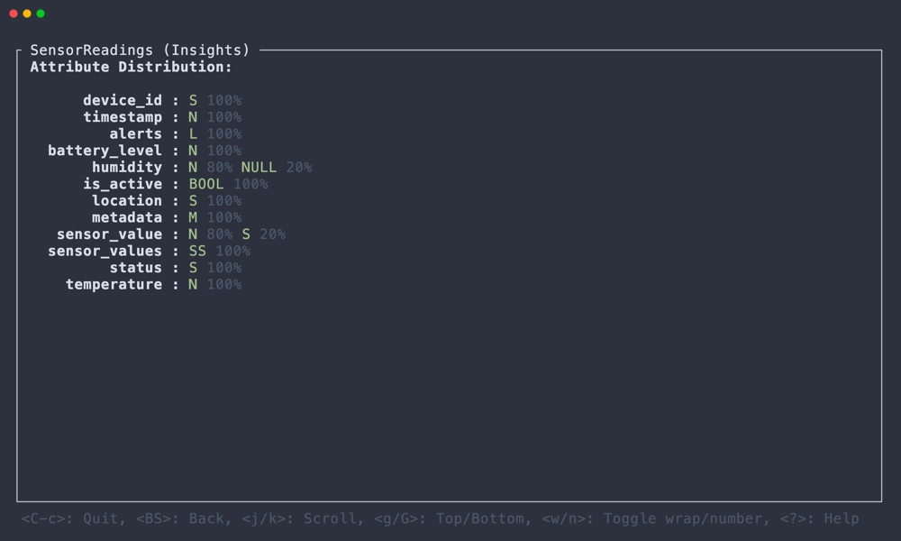

# DDV

[](https://crates.io/crates/ddv)

Terminal DynamoDB Viewer ⚡️


## About

> [!NOTE]
> This application is in early development. It is missing a lot of features and behaviors.

DDV is a TUI application to view Amazon DynamoDB in the terminal.

> [!WARNING]
> This application is designed to be used in a local environment or in a development environment with a small amount of data. It is not suitable for use in a production environment with large amounts of data.

### Goals

- Provide a simple way to view, search, update, and delete DynamoDB items in the terminal.

### Non-Goals

- Efficiently handling large tables for querying or updating.
- Offering full support for all DynamoDB API operations.

## Installation

### [Cargo](https://crates.io/crates/ddv)

```
$ cargo install --locked ddv
```

### [Homebrew (macOS)](https://github.com/lusingander/homebrew-tap/blob/master/ddv.rb)

```
$ brew install lusingander/tap/ddv
```

### [X-CMD](https://x-cmd.com/)

```
$ x install ddv
```

### Downloading binary

You can download pre-compiled binaries from [releases](https://github.com/lusingander/ddv/releases).

## Usage

After installation, run the following command:

```
$ ddv
```

Basically, you can use it in [the same way as the AWS CLI](https://docs.aws.amazon.com/cli/latest/userguide/cli-configure-files.html).

In other words, if the default profile settings exist or [the environment variables are set](https://docs.aws.amazon.com/cli/latest/userguide/cli-configure-envvars.html), you do not need to specify any options.

### Options

```
DDV - Terminal DynamoDB Viewer ⚡️

Usage: ddv [OPTIONS]

Options:
  -r, --region <REGION>     AWS region
  -e, --endpoint-url <URL>  AWS endpoint url
  -p, --profile <NAME>      AWS profile name
  -h, --help                Print help
  -V, --version             Print version
```

### Keybindings

The basic key bindings are as follows:

| Key                                   | Description          |
| ------------------------------------- | -------------------- |
| <kbd>Ctrl-C</kbd>                     | Quit app             |
| <kbd>Enter</kbd>                      | Open selected item   |
| <kbd>Backspace</kbd>                  | Go back to previous  |
| <kbd>j/k/h/l</kbd> <kbd>↓/↑/←/→</kbd> | Select item / Scroll |
| <kbd>?</kbd>                          | Show help            |

Detailed operations on each view can be displayed by pressing `?` key.

### Config

If the `DDV_CONFIG` environment variable specifies the path to the config file, the config will be loaded.

The config file uses the following format:

```toml
# The default region to use if the region cannot be obtained from the command line options or AWS settings.
# type: string
default_region = "us-east-1"

[ui.table_list]
# The width of the table list.
# type: u16
list_width = 30

[ui.table]
# The maximum column width for each attributes.
# type: u16
max_attribute_width = 30
# The maximum width of the expansion.
# type: u16
max_expand_width = 35
# The maximum height of the expansion.
# type: u16
max_expand_height = 6
```

## Screenshots

        

## Related projects

- [STU](https://github.com/lusingander/stu) - TUI explorer application for Amazon S3

## License

MIT
